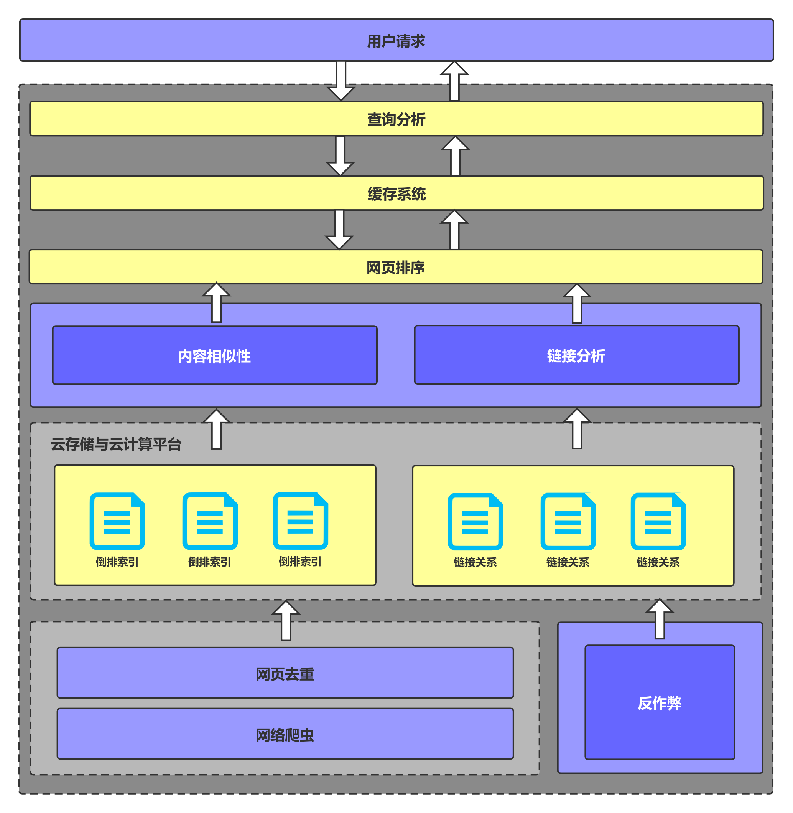

# 《这就是搜索引擎》读书笔记

    
    

## 网络爬虫 & 网页去重

搜索引擎的信息源来自于互联网网页，通过 **网络爬虫** 将整个互联网的信息获取到本地，因为互联网页面中有相当大比例的内容是完全相同或者近似重复的，**“网页去重”** 模块会对此做出检测，并去除重复内容。

*具体可参考：[网络爬虫](./网络爬虫) 和 [网页去重](./网页去重)*

## 倒排索引 & 链接分析

在此之后，搜索引擎会对网页进行解析，抽取出网页主体内容，以及页面中包含的指向其他页面的链接。为了加快响应用户查询的速度，网页内容通过 **“倒排索引”** 这种高效查询数据结构来保存，而网页之间的 **链接关系** 也会予以保存。之所以要保存链接关系，是因为这种关系在网页相关性排序阶段是可利用的，通过 **“链接分析”** 可以判断页面的相对重要性，对于为用户提供准确的搜索结果帮助很大。

*具体可参考：[倒排索引](./倒排索引) 和 [链接分析](./链接分析)*